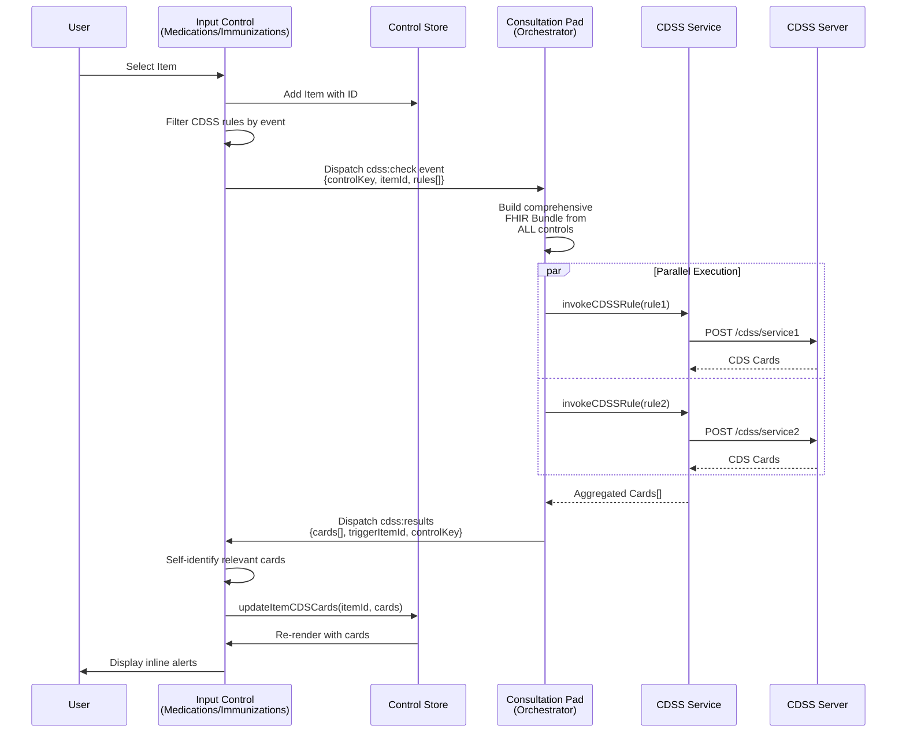

# Architecture Decision Record: CDSS Integration in Bahmni Clinical Module

**Date**: December 2024
**Status**: Implemented
**Authors**: Bahmni Development Team

## Context

The Bahmni Clinical Module needed to integrate Clinical Decision Support System (CDSS) capabilities to provide real-time clinical guidance during consultations. Key requirements included:

- **Clinical Safety**: Real-time alerts for drug interactions, vaccine contraindications, and protocol compliance
- **Multiple Input Controls**: Support needed across medications, immunizations, diagnoses, and other clinical forms
- **Performance**: Non-blocking UI operations with sub-second response times
- **Extensibility**: Easy addition of new CDSS rules and input controls without core changes
- **Comprehensive Context**: CDSS decisions need full clinical context from all active controls

## Decision

We implemented an **event-driven architecture with item-level CDS card storage** using the following key design decisions:

### 1. Event-Driven Communication

**Decision**: Use custom browser events (`cdss:check` and `cdss:results`) with pre-filtered rules in the payload.

**Rationale**:
- Decouples input controls from CDSS orchestration logic
- Rules are filtered once at the source, avoiding duplicate processing
- Clean separation between UI components and CDSS service layer

### 2. Item-Level Card Storage

**Decision**: Store CDS cards at individual item level within each input control's store.

**Rationale**:
- Precise association between alerts and specific items
- Independent state management per control
- Clear visual correlation in UI (cards displayed with their items)

### 3. ConsultationPad as Orchestrator

**Decision**: ConsultationPad acts as the central orchestrator for CDSS operations.

**Rationale**:
- Single point for building comprehensive FHIR bundles
- Centralized configuration loading and caching
- Consistent error handling and notification

### 4. Parallel Rule Execution

**Decision**: Execute multiple CDSS rules simultaneously using Promise.all().

**Rationale**:
- ~58% performance improvement over sequential execution
- Better user experience with faster response times
- Fault isolation - one failing rule doesn't block others

## Event Flow Architecture



## Implementation Details

### Event Payload Structure

```typescript
// cdss:check event - Sent from input controls
interface CDSSCheckEventDetail {
  controlKey: string;        // e.g., "medications", "immunizations"
  itemId: string;           // Unique ID of selected item
  rules: CDSSRule[];        // Pre-filtered CDSS rules for this event
}

// cdss:results event - Broadcast from ConsultationPad
interface CDSSResultsEventDetail {
  cards: CDSCard[];         // All CDS cards from CDSS services
  triggerItemId: string;    // ID of item that triggered check
  controlKey: string;       // Control that initiated request
}
```

### Configuration Structure

```json
// app.json - Input control configuration
{
  "type": "medications",
  "cdss": [
    {
      "event": "onSelect",      // Trigger event
      "server": "mihealth-cdss", // Server identifier
      "service": "drug-interaction-check" // Service name
    }
  ]
}

// cdss-servers.json - CDSS server configuration
{
  "server": "mihealth-cdss",
  "url": "/openmrs/ws/rest/v1/mihealth/cdss",
  "services": [
    {
      "name": "drug-interaction-check",
      "contextResourceMap": [
        {
          "type": "MedicationRequest",
          "attribute": "draftOrders"
        }
      ]
    }
  ]
}
```

## Alternatives Considered

| Alternative | Description | Why Rejected |
|------------|-------------|--------------|
| **Centralized Store** | Single Redux store for all CDS cards | Would create tight coupling between independent controls |
| **Direct API Calls** | Each control calls CDSS directly | Loses comprehensive context; duplicates logic across controls |
| **Synchronous Processing** | Block UI during CDSS checks | Poor user experience; risk of timeouts |
| **Event with Context** | Pass full context in events | Larger payloads; context better built centrally |

## Consequences

### Positive
- ✅ **Scalable**: New controls integrate by implementing InputControl interface
- ✅ **Performant**: Parallel execution, non-blocking operations
- ✅ **Maintainable**: Clean separation of concerns
- ✅ **Configurable**: JSON-driven without code changes
- ✅ **Comprehensive**: Full clinical context in every CDSS call

### Negative
- ❌ **Timing Risk**: Async CDSS calls may not complete before user saves, potentially missing critical alerts (requires UI safeguards)
- ❌ **Event Complexity**: Debugging distributed event flows across components

## Future Enhancements

1. **CDS Card Suggestions**: Display actionable suggestions with buttons
2. **onSave Event**: Consultation-level validation before submission
3. **System Actions**: Global CDSS rules affecting multiple controls
4. **Response Caching**: Cache identical CDSS queries
5. **Prefetch Optimization**: Pre-load commonly needed data

## References

- [CDS Hooks Specification](https://cds-hooks.org/)
- [HL7 FHIR R4 Clinical Decision Support](https://www.hl7.org/fhir/clinicalreasoning-cds-on-fhir.html)
- [Pull Request: BAH-4734-cdss Event driven Implementation](https://github.com/Bahmni/bahmni-apps-frontend/pull/436)