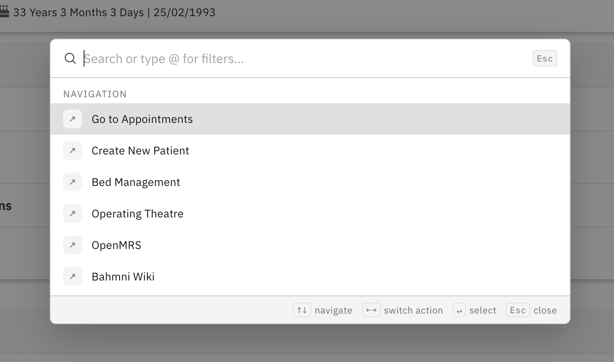
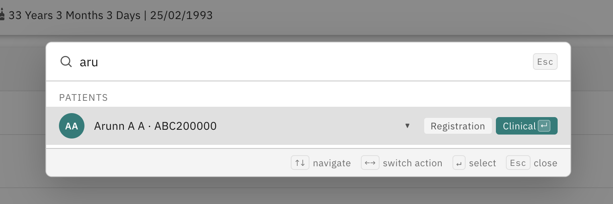
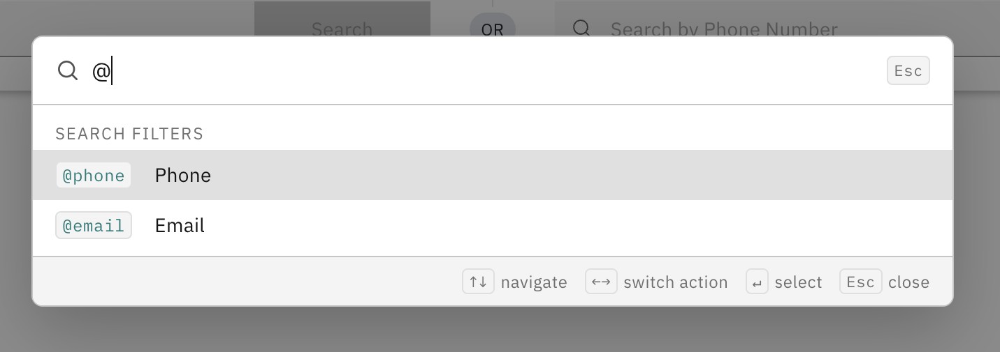
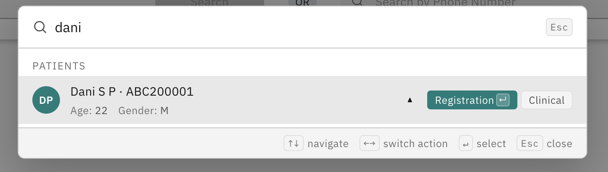
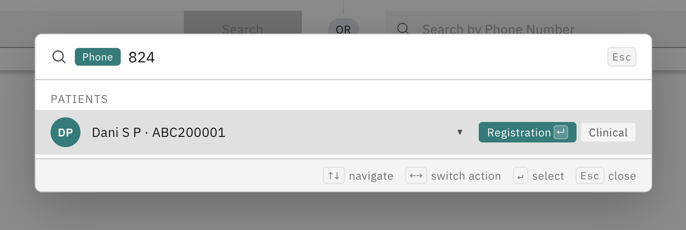
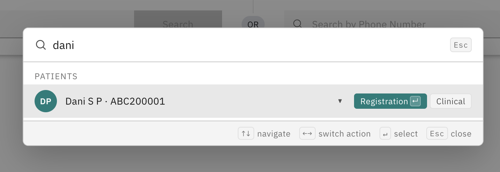

# Command Palette — Implementer Guide

The Command Palette is a keyboard-triggered search and navigation overlay. It lets users jump to any part of the application or open a patient record with a single keystroke — without using the mouse.



---

## Opening the Palette

| Platform | Default Shortcut |
|---|---|
| macOS | `Cmd + K` |
| Windows / Linux | `Ctrl + K` |

The shortcut is configurable. See [Keyboard Trigger](#keyboard-trigger).

---

## What It Does

- **Navigation** — Lists quick links to application modules (Registration, Appointments, Bed Management, etc.)
- **Patient Search** — Search patients by name, ID, or custom attributes (phone, email, etc.)
- **Patient Actions** — After selecting a patient, shows action buttons to open them in specific modules (Clinical, Registration, etc.)





---

## Configuration Files

| What | File | Repo |
|---|---|---|
| Keyboard trigger, patient fields, search annotations, which apps contribute extensions | `openmrs/apps/home/app.json` | `standard-config` |
| Navigation items and patient actions per app | `openmrs/apps/{appName}/v2/extension.json` | `standard-config` |

---

## `home/app.json` — Central Configuration

All Command Palette settings live under the `commandPalette` key.

```json
{
  "id": "bahmni.homepage",
  "commandPalette": {
    "trigger": {
      "type": "combination",
      "keys": "cmd+k"
    },
    "extensionApps": ["home", "registration", "clinical", "appointments", "adt", "ot"],
    "patientFields": {
      "primaryFields": ["name", "identifier"],
      "additionalFields": ["age", "gender"]
    },
    "searchAnnotations": [
      {
        "prefix": "@phone",
        "label": "Phone",
        "searchType": "patientAttribute",
        "fieldType": "person",
        "fieldsToSearch": ["phoneNumber"]
      },
      {
        "prefix": "@email",
        "label": "Email",
        "searchType": "patientAttribute",
        "fieldType": "person",
        "fieldsToSearch": ["email"]
      }
    ]
  }
}
```

### `extensionApps`

Lists every app whose `v2/extension.json` contains Command Palette items. If an app is not listed here, its extensions are ignored.

```json
"extensionApps": ["home", "registration", "clinical", "appointments", "adt", "ot"]
```

> **Important:** When you add Command Palette items to a new app's `v2/extension.json`, you must also add that app name to this list.

---

## Keyboard Trigger

### Combination (key chord)

Press all keys simultaneously.

```json
"trigger": {
  "type": "combination",
  "keys": "cmd+k"
}
```

Supported modifier tokens: `cmd` / `meta`, `ctrl`, `shift`, `alt`.

Examples:
- `"ctrl+k"` — Ctrl + K
- `"meta+shift+p"` — Cmd/Win + Shift + P
- `"ctrl+shift+p"` — Ctrl + Shift + P

### Double-tap

Tap the same key twice quickly.

```json
"trigger": {
  "type": "double",
  "key": "k",
  "interval": 350
}
```

| Field | Required | Default | Description |
|---|---|---|---|
| `type` | Yes | — | `"double"` |
| `key` | Yes | — | Single character key to double-tap |
| `interval` | No | `350` | Maximum milliseconds between taps |

> Double-tap is ignored when focus is inside an input field, textarea, or select element.

---

## Patient Fields

Controls which patient data appears in search results.

```json
"patientFields": {
  "primaryFields": ["name", "identifier"],
  "additionalFields": ["age", "gender"]
}
```

- **`primaryFields`** — Always visible on the patient row.
- **`additionalFields`** — Visible after expanding the row (chevron button).

Both accept any combination of the following values:

| Value | Description |
|---|---|
| `name` | Patient full name |
| `identifier` | Primary patient identifier |
| `age` | Calculated age |
| `gender` | Gender |
| `birthDate` | Date of birth |
| `addressFieldValue` | First address field value |
| `extraIdentifiers` | Additional identifiers |
| `customAttribute` | Custom person attribute |
| `activeVisitUuid` | UUID of active visit (if any) |



---

## Search Annotations

Search annotations let users filter patient searches using a `@prefix` shorthand.

```json
"searchAnnotations": [
  {
    "prefix": "@phone",
    "label": "Phone",
    "searchType": "patientAttribute",
    "fieldType": "person",
    "fieldsToSearch": ["phoneNumber"]
  }
]
```

Typing `@phone ` in the palette switches to phone number search mode.



| Field | Required | Description |
|---|---|---|
| `prefix` | Yes | Trigger string (must start with `@`) |
| `label` | Yes | Display label shown as a badge |
| `searchType` | No | `"patientAttribute"` (default) or `"patientNameOrId"` |
| `fieldType` | Yes (unless `searchType` is `patientNameOrId`) | `"person"` or `"address"` |
| `fieldsToSearch` | Yes (unless `searchType` is `patientNameOrId`) | Array of attribute field names to search |

To add a search by National ID:

```json
{
  "prefix": "@nid",
  "label": "National ID",
  "searchType": "patientAttribute",
  "fieldType": "person",
  "fieldsToSearch": ["nationalId"]
}
```

---

## Registering Commands — `v2/extension.json`

Each app contributes its own Command Palette items via its `v2/extension.json`. Two types of items are supported.

### Extension Point IDs

| Type | `extensionPointId` |
|---|---|
| Navigation link | `org.bahmni.commandpalette.navItem` |
| Patient action button | `org.bahmni.commandpalette.patientAction` |

---

### Navigation Item

A link that appears in the Command Palette list. Selecting it navigates to the specified URL.

```json
{
  "id": "org.bahmni.commandpalette.nav.registration",
  "extensionPointId": "org.bahmni.commandpalette.navItem",
  "label": "Go to Registration",
  "url": "/bahmni-new/registration/search",
  "icon": "fa-registered",
  "order": 1,
  "requiredPrivilege": "app:registration",
  "newTab": false
}
```

| Field | Required | Type | Description |
|---|---|---|---|
| `id` | Yes | string | Unique identifier across all extensions |
| `extensionPointId` | Yes | string | Must be `org.bahmni.commandpalette.navItem` |
| `label` | Yes | string | Text shown in the palette |
| `url` | Yes | string | Destination path or full URL |
| `order` | No | number | Sort position (lower = higher up) |
| `icon` | No | string | FontAwesome icon class (e.g. `fa-user`) |
| `newTab` | No | boolean | Open in a new browser tab. Defaults to `false`. External URLs (`https://...`) always open in a new tab regardless of this field. |
| `requiredPrivilege` | No | string | OpenMRS privilege required to see this item |
| `appContext` | No | string | Restrict this item to a specific app only |

---

### Patient Action

A button that appears after selecting a patient in search results. Navigates to a patient-specific URL.

```json
{
  "id": "org.bahmni.commandpalette.action.clinical",
  "extensionPointId": "org.bahmni.commandpalette.patientAction",
  "label": "Clinical",
  "icon": "fa-stethoscope",
  "pathTemplate": "/bahmni-new/clinical/{{patientUuid}}",
  "order": 2,
  "requiredPrivilege": "app:clinical"
}
```

| Field | Required | Type | Description |
|---|---|---|---|
| `id` | Yes | string | Unique identifier across all extensions |
| `extensionPointId` | Yes | string | Must be `org.bahmni.commandpalette.patientAction` |
| `label` | Yes | string | Button label shown after patient selection |
| `pathTemplate` | Yes | string | URL template — use `{{patientUuid}}` and/or `{{patientIdentifier}}` as placeholders |
| `order` | No | number | Sort position of the action button |
| `icon` | No | string | FontAwesome icon class |
| `requiredPrivilege` | No | string | OpenMRS privilege required to see this button |
| `appContext` | No | string | Restrict this button to a specific app only |



---

## Privilege-Based Access Control

Add `requiredPrivilege` to any extension item. Users who do not have that privilege will not see the item — it is hidden entirely.

```json
"requiredPrivilege": "app:registration"
```

Common privilege values used in the default config:

| Privilege | Controls access to |
|---|---|
| `app:registration` | Registration items |
| `app:clinical` | Clinical items |
| `app:appointments` | Appointments items |
| `app:adt` | Bed Management items |
| `app:ot` | Operating Theatre items |
| `app:admin` | Admin / OpenMRS items |

Items with no `requiredPrivilege` are visible to all logged-in users.

---

## App Context Filtering (`appContext`)

By default, a Command Palette item appears in every Bahmni app. Use `appContext` to restrict an item to a specific app.

```json
{
  "id": "org.bahmni.commandpalette.nav.adt.transfer",
  "extensionPointId": "org.bahmni.commandpalette.navItem",
  "label": "Transfer Patient",
  "url": "/bahmni/bedmanagement/transfer",
  "appContext": "adt"
}
```

This item only appears when the user is in the ADT (Bed Management) app.

| App | `appContext` value |
|---|---|
| Home | `home` |
| Registration | `registration` |
| Clinical | `clinical` |
| Appointments | `appointments` |
| Bed Management / ADT | `adt` |
| Operating Theatre | `ot` |

---

## All Items at a Glance (Default Config)

### Navigation Items

| Label | App | Order | Privilege |
|---|---|---|---|
| Go to Registration | registration | 1 | `app:registration` |
| Go to Appointments | appointments | 2 | `app:appointments` |
| Create New Patient | registration | 3 | `app:registration` |
| Bed Management | adt | 4 | `app:adt` |
| Operating Theatre | ot | 5 | `app:ot` |
| OpenMRS | home | 6 | `app:admin` |
| Bahmni Wiki | home | 7 | _(none — public)_ |

### Patient Action Buttons

| Label | App | Order | Privilege |
|---|---|---|---|
| Registration | registration | 1 | `app:registration` |
| Clinical | clinical | 2 | `app:clinical` |

---

## Examples

### Add a navigation link to Registration

In `openmrs/apps/registration/v2/extension.json`:

```json
{
  "cmdPaletteNavRegistration": {
    "id": "org.bahmni.commandpalette.nav.registration",
    "extensionPointId": "org.bahmni.commandpalette.navItem",
    "label": "Go to Registration",
    "url": "/bahmni-new/registration/search",
    "icon": "fa-registered",
    "order": 1,
    "requiredPrivilege": "app:registration"
  }
}
```

Ensure `"registration"` is listed in `extensionApps` in `openmrs/apps/home/app.json`:

```json
"extensionApps": ["home", "registration", "clinical", "appointments", "adt", "ot"]
```

---

### Add a patient action to open in Clinical

In `openmrs/apps/clinical/v2/extension.json`:

```json
{
  "cmdPaletteActionClinical": {
    "id": "org.bahmni.commandpalette.action.clinical",
    "extensionPointId": "org.bahmni.commandpalette.patientAction",
    "label": "Clinical",
    "icon": "fa-stethoscope",
    "pathTemplate": "/bahmni-new/clinical/{{patientUuid}}",
    "order": 2,
    "requiredPrivilege": "app:clinical"
  }
}
```

Ensure `"clinical"` is listed in `extensionApps` in `openmrs/apps/home/app.json`.

---

### Add an app-scoped navigation item (visible only in Registration)

In `openmrs/apps/registration/v2/extension.json`:

```json
{
  "cmdPaletteNavRegisterNewPatient": {
    "id": "org.bahmni.commandpalette.nav.registration.new",
    "extensionPointId": "org.bahmni.commandpalette.navItem",
    "label": "Register New Patient",
    "url": "/bahmni-new/registration/patient/new",
    "icon": "fa-user-plus",
    "order": 10,
    "requiredPrivilege": "app:registration",
    "appContext": "registration"
  }
}
```

This item only appears when the user is inside the Registration app.

---

### Add a search annotation for Alternate Phone Number

In `openmrs/apps/home/app.json`:

```json
"searchAnnotations": [
  {
    "prefix": "@phone",
    "label": "Phone",
    "searchType": "patientAttribute",
    "fieldType": "person",
    "fieldsToSearch": ["phoneNumber"]
  },
  {
    "prefix": "@altphone",
    "label": "Alt Phone",
    "searchType": "patientAttribute",
    "fieldType": "person",
    "fieldsToSearch": ["alternatePhoneNumber"]
  }
]
```

The user types `@altphone ` followed by the number to search by alternate phone.

---

## Notes and Limitations

- **`extensionApps` is the source of truth** — any app not listed there is silently ignored even if its `v2/extension.json` has Command Palette items.
- **Config is loaded once on page load** — changes to JSON files take effect after a browser refresh.
- **Items without `requiredPrivilege` are visible to all users** — add one if access should be restricted.
- **Items without `appContext` appear everywhere** — add one if the item is only relevant in a specific app.
- **External URLs** (starting with `http://` or `https://`) always open in a new tab, regardless of the `newTab` field.
- **`order` values are global** — items from all apps are sorted together, so coordinate `order` values across apps to get the desired sequence.
- **Double-tap trigger does not fire inside input fields** — this is intentional to avoid conflicts while typing.
