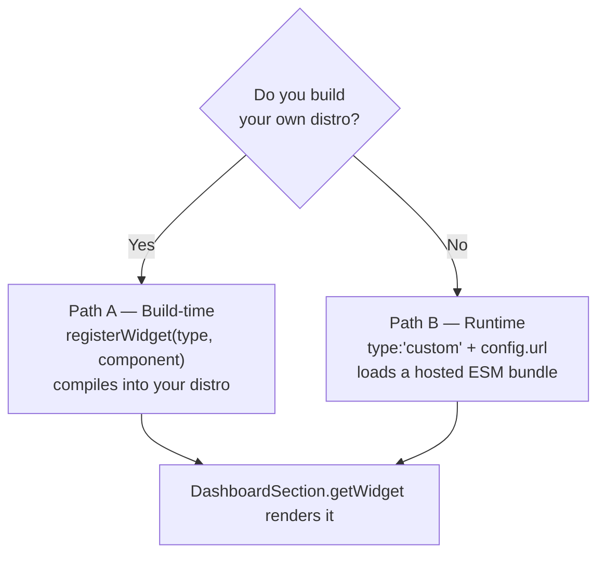
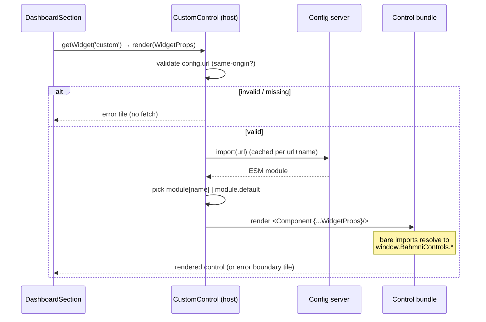
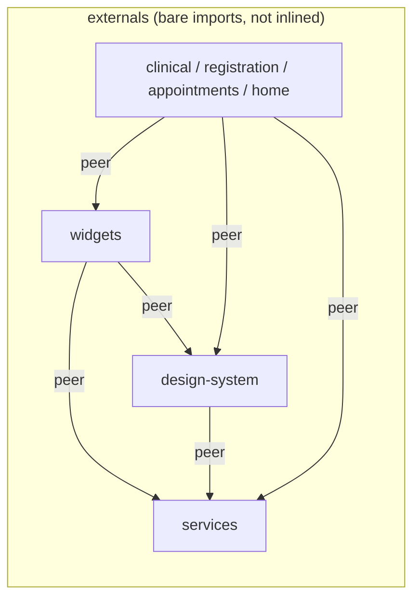
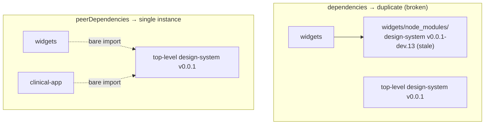
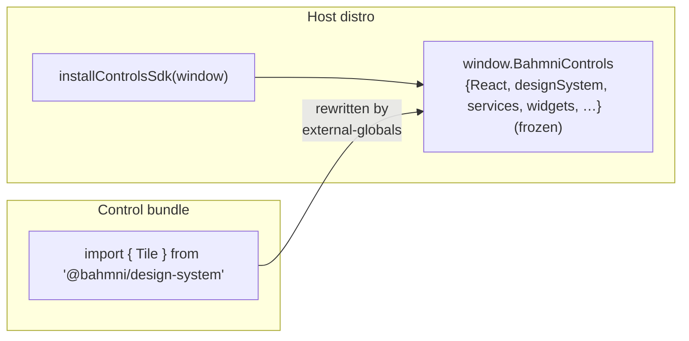
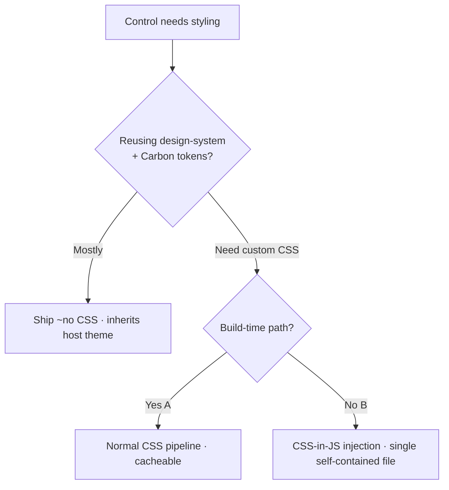
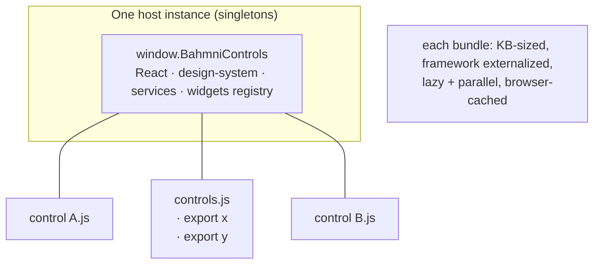

# Custom Display Controls — Architecture

> Design rationale and system architecture for implementation-authored dashboard controls.
> For the step-by-step authoring how-to, see [`custom-display-controls.md`](./custom-display-controls.md).

---

## 1. Problem & goals

Implementations need to add their **own** clinical-dashboard widgets without forking or rebuilding
the Bahmni frontend. A "custom display control" is a React component rendered inside a dashboard
section, indistinguishable at runtime from a built-in widget such as `AllergiesTable`.

**Goals**

- **No host fork.** An implementation ships a control without touching Bahmni source.
- **One contract.** Custom controls use the same `WidgetProps` interface as built-in widgets.
- **One framework instance.** Exactly one React / design-system / services instance is shared, so
  hooks, context, theming, and the React Query cache all work across the boundary.
- **Failure isolation.** A broken control degrades to an error tile; the rest of the dashboard
  renders normally.
- **Two deployment shapes.** Support both implementations that build their own distro and those
  that consume a prebuilt one.

**Non-goals**

- Sandboxing untrusted third-party code (controls are admin-deployed and trusted — see §8).
- API-version negotiation between host and control (best-effort compatibility for now).

---

## 2. Foundations that already existed

The design is deliberately small because it reuses three things already in the codebase:

| Building block | Location | Role |
|---|---|---|
| **Widget registry** (singleton `Map`) | `packages/bahmni-widgets/src/registry/index.ts` | `registerWidget` / `getWidget` by `type` string |
| **Built-in widget map** | `packages/bahmni-widgets/src/registry/widgetMap.ts` | `{ type, component: lazy(...) }[]` |
| **Renderer** | `apps/clinical/src/components/dashboardSection/DashboardSection.tsx` | `getWidget(control.type)` → render in `<Suspense>` with `WidgetProps` |
| **Config-driven dashboard** | dashboard JSON | each control entry already carries an arbitrary `config` object |

The `config` object was already free-form, so no schema change was needed to carry a `url`/`name`.

```
WidgetProps = { config?, episodeOfCareUuids?, encounterUuids?, visitUuids?, onEditClick?, disableActions? }
```

---

## 3. Two integration models

There are two ways to register a control. The control *component* is identical in both — only the
registration/loading mechanism differs.

| Implementation type | Path | Registration | Separate repo? | Runtime URL load? |
|---|---|---|---|---|
| Builds its **own distro** (e.g. IOM) | **A — build-time** | `registerWidget` at bootstrap | No | No |
| Consumes a **prebuilt distro** | **B — runtime** | built-in `type: 'custom'` + `config.url` | Yes | Yes |
| Own distro, wants independent deploy | Either | either | Optional | Optional |



### Path A — build-time registration

The implementation authors the control in its own repo/package and calls `registerWidget` during
distro bootstrap. It compiles straight into the distro bundle: no hosted JS, no `window` global, no
CSP concerns, full type-safety. This is the natural path for own-distro builders.

### Path B — runtime drop-in

The implementation builds the control as a **separate ESM bundle**, hosts it on the config server,
and references its URL from the dashboard config. The host ships **one** built-in widget,
`type: 'custom'`, that is a loader + export-selector + error boundary.

```jsonc
{ "type": "custom", "config": { "url": "/custom/controls.js", "name": "patientSummary" } }
```

One bundle can export many controls; `config.name` selects which (default export if omitted).

---

## 4. Runtime loader (Path B) in detail

The `custom` widget (`packages/bahmni-widgets/src/custom/CustomControl.tsx`) does four things:

1. **Validate `url`** — same-origin, `http(s)` only. Reject → error tile, no network request.
2. **Lazy-import** the ESM bundle via native `import(url)` (memoized per `url+name` in a module-level
   `Map`, so re-renders and sibling entries don't re-fetch).
3. **Select the export** — `config.name` → named export, else default export.
4. **Render** inside `<Suspense>`, wrapped in a `ControlErrorBoundary` so a throw/load-failure shows
   an error tile instead of taking down the dashboard.



`/* webpackIgnore: true */` on the dynamic import keeps it a **native** browser import so Webpack
doesn't try to bundle a URL it can't see.

---

## 5. The shared-singleton problem (the crux)

A custom control calling `useState` or a Bahmni context hook **must** use the host's React instance.
Two React copies → "invalid hook call" and dead contexts. The same applies to the widget registry
(`registerWidget` must write to the registry `DashboardSection` reads) and to design-system theming
and the React Query cache.

This is solved at **two layers**, because they govern different things:

### 5a. Bundler externalization — *don't inline a copy*

Each published package/app marks the shared deps as Rollup `external`, so its `dist` emits bare
`import … from "@bahmni/widgets"` instead of inlining the code. Applied across the whole internal
graph:



### 5b. `peerDependencies` — *resolve to one copy on disk*

Externalization only stops *inlining*; it does **not** decide which physical copy on disk a bare
import resolves to. That is the `node_modules` layout, governed by dependency **type**. As regular
`dependencies`, npm is free to install a private nested copy under `widgets/node_modules/…` — which
both defeats the singleton and (as observed in IOM) can pin a stale version. Declaring the internal
`@bahmni/*` deps as **`peerDependencies`** (exactly like `react`) forces the consumer to provide one
hoisted copy.



> **Rule of thumb:** *externalization is necessary but not sufficient.* For a true singleton across
> a published-package boundary you need **both** the Rollup `external` entry **and** the
> `peerDependency` declaration.

### 5c. The runtime SDK global (Path B only)

A separately-hosted bundle can't `import '@bahmni/widgets'` from `node_modules` it doesn't have. So
the host exposes its **own** singletons on `window.BahmniControls`, and the control's bundler
rewrites bare imports to read off that global (`rollup-plugin-external-globals`). The host installs
it with a one-liner exported from `@bahmni/widgets`:



Because `installControlsSdk` lives in `@bahmni/widgets` and imports the (externalized, peer-resolved)
shared packages, the objects on the global **are** the running app's instances — closing the loop
with 5a/5b.

---

## 6. CSS delivery

A control's own styling is a separate concern from its JS. Ranked by preference:

1. **Ship (almost) none.** Compose design-system components and use Carbon tokens, which compile to
   CSS custom properties (`var(--cds-*)`) and inherit the host's theme. No CSS shipped, automatically
   theme-consistent. This is the dominant case and the strongest "approach."
2. **Build-time path (A):** custom CSS flows through the normal Vite/Webpack pipeline — extracted,
   hashed, HTTP-cacheable. Strictly best, but only available to own-distro builders.
3. **CSS-in-JS injection (runtime default):** `vite-plugin-css-injected-by-js` inlines the control's
   own CSS into the single JS file and injects a `<style>` at load. Right default for Path B because
   `import(url)` fetches only one file and needs zero host cooperation.



Rejected for now: **sibling `.css` fetched by the loader** (browser-cacheable, but needs a host-side
loader change + a second request — defer until inlining limits are actually hit), and **Shadow DOM /
adopted stylesheets** (real isolation, but Carbon relies on global `:root` tokens and renders
modals/menus to `document.body` outside the shadow root — it breaks Carbon).

---

## 7. Alternatives considered

| Alternative | Why not chosen |
|---|---|
| **Module Federation** (Webpack MF / Vite federation) | Heavy shared-scope runtime + build coupling; the repo has no MF and mixes Webpack (distro) + Vite (libs). A `window` global + `external-globals` achieves the one-instance goal with far less machinery. |
| **UMD/IIFE bundles** | Native `import(url)` only loads ES modules. ESM is required; UMD would need a custom script-tag loader and a global handshake. |
| **Bundle React into each control** | Guarantees duplicate-React "invalid hook call" and re-downloads the framework per control. Externalization to the shared singleton is mandatory. |
| **`<iframe sandbox>` / Web Worker isolation** | Needed only for *untrusted* code; controls are admin-deployed and trusted. Would require a `postMessage` bridge and lose direct DOM/host-hook access — a major re-architecture. |
| **Import maps for shared deps** | Viable but adds a host-managed import-map and browser-support surface; the SDK global is simpler and already had precedent (`window.React` for form2-controls). |
| **Server-side / config-time compilation** | Pushes a build toolchain onto the config server and loses the "drop a JS file" simplicity. |
| **`dependencies` (not peer) for internal pkgs** | Caused the IOM duplicate/stale-copy failure — see §5b. |

---

## 8. Security model

The trust boundary is **admin/deployment**: dashboard configs and hosted bundles are admin-controlled,
same as the config that already decides what renders. `import(url)` executes remote code with full
host privileges — there is **no sandbox** by design.

- **S1 — Freeze the SDK** (`Object.freeze(window.BahmniControls)`): can't swap `registerWidget` or
  shared components.
- **S2 — Same-origin URL validation** in the loader: blocks config-driven RCE from arbitrary origins;
  cheapest, highest-value control.
- **S3 — Strict CSP at deployment:** `script-src 'self' <config-origin>`; the design needs **no**
  `'unsafe-eval'`, so a strict CSP stays intact. Add `connect-src` to bound exfiltration.
- **S4 — Error boundary ≠ security boundary:** it contains crashes, not malice. Untrusted controls
  would require the sandbox re-architecture in §7.

---

## 9. How it scales

**Many controls.** One bundle with N named exports = one fetch (the loader caches per `url`, selects
N by name). N separate URLs = N fetches, each KB-sized because the framework is externalized. Loads
are parallel and lazy behind individual `<Suspense>`, so one slow control never blocks siblings.

**Caching.** Static, hash-named bundles ride the browser HTTP cache and the distro's existing service
worker after first load. The framework itself is never re-downloaded (it's the host's already-loaded
singleton).

**Pitfall — heavy non-SDK libs.** N bundles each re-bundling the same heavy library (e.g. a charting
lib) pays N×. Mitigations: ship related controls in one bundle, or promote the heavy dep into the SDK
global so it becomes a shared singleton too.

**Many implementations.** Each implementation owns its bundles/registrations independently; there is
no central registry to coordinate. Build-time registrations live in each distro; runtime controls
live on each config server. The only shared contract is `WidgetProps` + the SDK surface.

**Versioning.** Best-effort today (no `apiVersion` handshake). The `WidgetProps` contract and the SDK
shape are the compatibility surface; widening them is backward-compatible, narrowing is not. If
controls and host begin to drift, the natural next step is a declared `apiVersion` on the SDK global
that the loader can check before rendering.



---

## 10. Component & file map

| Concern | File |
|---|---|
| `WidgetProps` contract | `packages/bahmni-widgets/src/registry/model.ts` |
| Registry singleton | `packages/bahmni-widgets/src/registry/index.ts` |
| Built-in map (incl. `custom`) | `packages/bahmni-widgets/src/registry/widgetMap.ts` |
| Runtime loader | `packages/bahmni-widgets/src/custom/CustomControl.tsx` |
| Error boundary | `packages/bahmni-widgets/src/custom/ControlErrorBoundary.tsx` |
| SDK type | `packages/bahmni-widgets/src/sdk.ts` |
| SDK installer | `packages/bahmni-widgets/src/installControlsSdk.ts` |
| Host bootstrap | `distro/src/main.tsx` |
| Renderer | `apps/clinical/src/components/dashboardSection/DashboardSection.tsx` |
| Externalization | each `vite.config.ts` `rollupOptions.external` + each `package.json` `peerDependencies` |
| Authoring how-to | `docs/custom-display-controls.md` |
| Starter template | `custom-control-starter/` (separate repo) |
```
