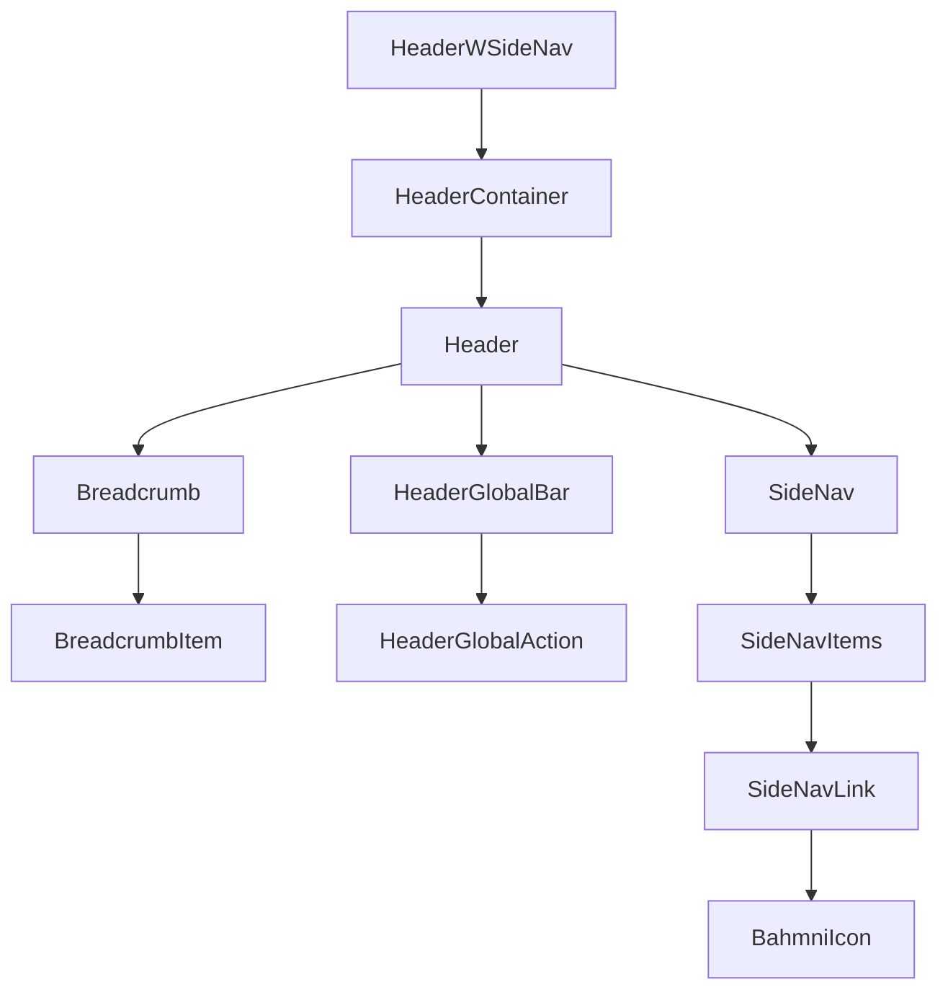

# HeaderWSideNav Component Guide

This guide provides comprehensive documentation for the HeaderWSideNav component implemented in the Bahmni Clinical Frontend application.

## Introduction

The HeaderWSideNav component combines a header with side navigation, breadcrumbs, and global actions. It serves as the primary navigation interface for the Bahmni Clinical application, providing healthcare professionals with a consistent and accessible means of navigating through the application's various features and workflows.

Key features of the HeaderWSideNav component include:

- **Side Navigation**: Provides main navigation options with icons for quick access to different sections
- **Breadcrumbs**: Shows hierarchical navigation context to help users understand their current location
- **Global Actions**: Quick access to global functions like search or notifications
- **Responsive Design**: Adapts to different screen sizes, including collapsing to a rail view on mobile devices
- **Accessibility Support**: ARIA-compliant for screen readers with proper keyboard navigation
- **i18n Support**: All text elements use translation keys for internationalization

The component is designed to be flexible and can be customized to support various clinical workflows and navigation patterns.

## Architecture Overview

The HeaderWSideNav component is built using React and TypeScript, leveraging Carbon Design System components for consistent styling and behavior.



### Component Structure

1. **HeaderWSideNav**: The main component that orchestrates all navigation elements
2. **HeaderContainer/Header**: Carbon components that provide the header container structure
3. **Breadcrumb/BreadcrumbItem**: Carbon components for hierarchical navigation
4. **HeaderGlobalBar/HeaderGlobalAction**: Carbon components for global actions in the header
5. **SideNav/SideNavItems/SideNavLink**: Carbon components for side navigation
6. **BahmniIcon**: Custom icon component for displaying icons in the side navigation

### Hooks Integration

The component uses a custom hook called `useHeaderSideNav` that manages:

- Side navigation expanded state
- Responsive behavior based on screen size
- Navigation click handling

## Component API

The HeaderWSideNav component accepts several props to customize its appearance and behavior.

### Props

| Prop                | Type                     | Description                                                     | Required |
| ------------------- | ------------------------ | --------------------------------------------------------------- | -------- |
| breadcrumbItems     | HeaderBreadcrumbItem[]   | Array of breadcrumb items to display in the header              | No       |
| globalActions       | HeaderGlobalAction[]     | Array of global action buttons to display in the header         | No       |
| sideNavItems        | HeaderSideNavItem[]      | Array of navigation items to display in the side navigation     | Yes      |
| activeSideNavItemId | string \| null           | ID of the currently active side navigation item                 | No       |
| onSideNavItemClick  | (itemId: string) => void | Callback function called when a side navigation item is clicked | Yes      |
| isRail              | boolean                  | Whether the side navigation should be displayed as a rail       | No       |
| ariaLabel           | string                   | Accessibility label for the header component                    | No       |

### Type Definitions

```typescript
// Side navigation item for header with side navigation component
export interface HeaderSideNavItem {
  id: string;
  icon: string;
  label: string;
  href?: string;
  renderIcon?: React.ComponentType<any>;
}

// Breadcrumb item for header with side navigation component
export interface HeaderBreadcrumbItem {
  id: string;
  label: string;
  href?: string;
  isCurrentPage?: boolean;
}

// Global action item for header with side navigation component
export interface HeaderGlobalAction {
  id: string;
  label: string;
  renderIcon: ReactNode;
  onClick: () => void;
}

// Props for the HeaderWSideNav component
export interface HeaderWSideNavProps {
  breadcrumbItems?: HeaderBreadcrumbItem[];
  globalActions?: HeaderGlobalAction[];
  sideNavItems: HeaderSideNavItem[];
  activeSideNavItemId?: string | null;
  onSideNavItemClick: (itemId: string) => void;
  isRail?: boolean;
  ariaLabel?: string;
}
```

### Default Values

- `breadcrumbItems`: `[]` (no breadcrumbs)
- `globalActions`: `[]` (no global actions)
- `activeSideNavItemId`: `null` (no active item)
- `ariaLabel`: `'HeaderWSideNav'` (default accessibility label)
- Note: The SideNav is always rendered with `isRail={true}`, making it always display in rail mode regardless of the `isRail` prop's value

## Navigation Patterns

The HeaderWSideNav component supports various navigation patterns commonly used in healthcare applications.

### Side Navigation

The side navigation provides the primary means of navigating between major sections of the application. Each side navigation item consists of:

- An icon string (automatically rendered using BahmniIcon - the component internally uses BahmniIcon to render icons from icon name strings)
- A label (which is translated using i18n)
- An optional href for direct linking

The component keeps track of the active navigation item through the `activeSideNavItemId` prop, which should match the `id` of the currently active navigation item.

**Important Note**: The component always renders side navigation icons using the BahmniIcon component, accepting an icon name string from the `icon` property of each side navigation item. This is different from global actions which accept React nodes directly.

### Breadcrumb Navigation

Breadcrumbs provide hierarchical context, showing the user's current location within the application structure. They are particularly useful in deep navigation hierarchies common in clinical applications.

The breadcrumbs are defined using the `breadcrumbItems` prop, where each item has:

- A unique ID
- A label (which is translated using i18n)
- An optional href for navigation
- An optional `isCurrentPage` flag to indicate the current page

Breadcrumbs are displayed in order, with the current page typically being the last item.

### Global Actions

Global actions are represented as icon buttons in the top-right corner of the header. They provide quick access to frequently used functions that are available across the application, such as:

- Search
- Notifications
- Settings
- User profile
- Help

Each global action consists of:

- A unique ID
- A label for accessibility and tooltips (which is translated using i18n)
- An icon element as ReactNode (JSX element using BahmniIcon)
- An onClick handler

**Important Note**:

- The `renderIcon` property now expects a React Node (JSX element) instead of a component reference
- Similar to side navigation items, global actions should use the BahmniIcon component
- The tooltipAlignment is now fixed to "end" for all global actions in the current implementation

Example of correct syntax for global actions:

```tsx
// Correct syntax - using BahmniIcon
import { ICON_SIZE } from '@constants/icon';
import BahmniIcon from '@components/common/bahmniIcon/BahmniIcon';

const globalActions = [
  {
    id: "search",
    label: "Search",
    renderIcon: (
      <BahmniIcon id="search-icon" name="fa-search" size={ICON_SIZE.LG} />
    ),
    onClick: () => console.log("Search clicked"),
  }
];
```

## Responsive Behavior

The HeaderWSideNav component is designed to be responsive across different screen sizes, which is particularly important in healthcare settings where different devices may be used.

### Desktop View

On desktop screens:

- Side navigation is expanded, showing icons and labels
- All breadcrumb items are visible
- All global actions are visible

### Tablet View

On tablet screens:

- Side navigation collapses to a rail view, showing only icons
- All breadcrumb items are visible
- All global actions are visible

### Mobile View

On mobile screens:

- Side navigation collapses to a rail view, showing only icons
- Breadcrumbs collapse to show only the current page
- Global actions remain visible

The responsive behavior is managed by the `useHeaderSideNav` hook, which detects the screen size and adjusts the side navigation's expanded state accordingly.

## Integration with Clinical Workflows

The HeaderWSideNav component can be customized to support various clinical workflows by configuring the appropriate navigation items and breadcrumbs.

### Patient Dashboard Workflow

For patient dashboards, typical configuration includes:

- Breadcrumbs showing the path from home to the specific patient
- Side navigation items for different sections of the patient record (Summary, Visits, Conditions, Medications, etc.)
- Global actions for patient-specific functions

### Clinical Consultation Workflow

For active consultations, typical configuration includes:

- Breadcrumbs showing the path from home to the current consultation
- Side navigation items for different aspects of the consultation (Observations, Diagnoses, Orders, Notes, etc.)
- Global actions for consultation-specific functions (Save, Complete, etc.)

### Department View Workflow

For department-specific views, typical configuration includes:

- Breadcrumbs showing the path from home to the specific department
- Side navigation items for department functions (Dashboard, Appointments, Patients, Reports, etc.)
- Global actions relevant to department management

## Usage Examples

### Basic Usage

```tsx
import React from "react";
import { HeaderWSideNav } from "@components/common/headerWSideNav/HeaderWSideNav";
import { Search, Notification, Settings } from "@carbon/icons-react";

const BasicHeader: React.FC = () => {
  // Define side navigation items
  const sideNavItems = [
    { id: "dashboard", icon: "fa-dashboard", label: "Dashboard" },
    { id: "patients", icon: "fa-user", label: "Patients" },
    { id: "reports", icon: "fa-chart-bar", label: "Reports" },
  ];

  // Handle navigation item clicks
  const handleSideNavItemClick = (itemId: string) => {
    console.log(`Nav item clicked: ${itemId}`);
    // Implement navigation logic here
  };

  return (
    <HeaderWSideNav
      sideNavItems={sideNavItems}
      activeSideNavItemId="dashboard"
      onSideNavItemClick={handleSideNavItemClick}
      ariaLabel="Bahmni Clinical"
    />
  );
};
```

### With Breadcrumbs and Global Actions

```tsx
import React from "react";
import { HeaderWSideNav } from "@components/common/headerWSideNav/HeaderWSideNav";
import BahmniIcon from "@components/common/bahmniIcon/BahmniIcon";
import { ICON_SIZE } from "@constants/icon";

const CompleteHeader: React.FC = () => {
  // Define breadcrumb items
  const breadcrumbItems = [
    { id: "home", label: "Home", href: "/" },
    { id: "patients", label: "Patients", href: "/patients" },
    { id: "patient", label: "John Doe", isCurrentPage: true },
  ];

  // Define global actions
  const globalActions = [
    {
      id: "search",
      label: "Search",
      renderIcon: (
        <BahmniIcon id="search-icon" name="fa-search" size={ICON_SIZE.LG} />
      ),
      onClick: () => console.log("Search clicked"),
    },
    {
      id: "notifications",
      label: "Notifications",
      renderIcon: (
        <BahmniIcon id="notification-icon" name="fa-bell" size={ICON_SIZE.LG} />
      ),
      onClick: () => console.log("Notifications clicked"),
    },
    {
      id: "settings",
      label: "Settings",
      renderIcon: (
        <BahmniIcon id="settings-icon" name="fa-cog" size={ICON_SIZE.LG} />
      ),
      onClick: () => console.log("Settings clicked"),
    },
  ];

  // Define side navigation items
  const sideNavItems = [
    { id: "dashboard", icon: "fa-dashboard", label: "Dashboard" },
    { id: "patients", icon: "fa-user", label: "Patients" },
    { id: "reports", icon: "fa-chart-bar", label: "Reports" },
  ];

  // Handle navigation item clicks
  const handleSideNavItemClick = (itemId: string) => {
    console.log(`Nav item clicked: ${itemId}`);
    // Implement navigation logic here
  };

  return (
    <HeaderWSideNav
      breadcrumbItems={breadcrumbItems}
      globalActions={globalActions}
      sideNavItems={sideNavItems}
      activeSideNavItemId="dashboard"
      onSideNavItemClick={handleSideNavItemClick}
      ariaLabel="Bahmni Clinical"
    />
  );
};
```

### Patient Dashboard Example

```tsx
import React from "react";
import { HeaderWSideNav } from "@components/common/headerWSideNav/HeaderWSideNav";
import { Search, Notification, User } from "@carbon/icons-react";
import { useNavigate } from "react-router-dom";

interface PatientHeaderProps {
  patientId: string;
  patientName: string;
}

const PatientHeader: React.FC<PatientHeaderProps> = ({
  patientId,
  patientName,
}) => {
  const navigate = useNavigate();

  // Define breadcrumb items for patient context
  const breadcrumbItems = [
    { id: "home", label: "Home", href: "/" },
    { id: "patients", label: "Patients", href: "/patients" },
    { id: "patient", label: patientName, isCurrentPage: true },
  ];

  // Define global actions
  const globalActions = [
    {
      id: "search",
      label: "Search",
      renderIcon: (
        <BahmniIcon id="search-icon" name="fa-search" size={ICON_SIZE.LG} />
      ),
      onClick: () => console.log("Search clicked"),
    },
    {
      id: "notifications",
      label: "Notifications",
      renderIcon: (
        <BahmniIcon id="notification-icon" name="fa-bell" size={ICON_SIZE.LG} />
      ),
      onClick: () => console.log("Notifications clicked"),
    },
    {
      id: "user",
      label: "User Profile",
      renderIcon: (
        <BahmniIcon id="user-icon" name="fa-user" size={ICON_SIZE.LG} />
      ),
      onClick: () => console.log("User profile clicked"),
    },
  ];

  // Define patient-specific navigation items
  const sideNavItems = [
    { id: "summary", icon: "fa-dashboard", label: "Summary" },
    { id: "visits", icon: "fa-calendar", label: "Visits" },
    { id: "conditions", icon: "fa-heartbeat", label: "Conditions" },
    { id: "medications", icon: "fa-pills", label: "Medications" },
    { id: "lab-results", icon: "fa-flask", label: "Lab Results" },
    { id: "vitals", icon: "fa-chart-line", label: "Vitals" },
  ];

  // Handle navigation item clicks
  const handleSideNavItemClick = (itemId: string) => {
    // Navigate to the appropriate section of the patient dashboard
    navigate(`/patients/${patientId}/${itemId}`);
  };

  return (
    <HeaderWSideNav
      breadcrumbItems={breadcrumbItems}
      globalActions={globalActions}
      sideNavItems={sideNavItems}
      activeSideNavItemId="summary" // Set the active section
      onSideNavItemClick={handleSideNavItemClick}
      ariaLabel="Patient Dashboard"
    />
  );
};
```

### Clinical Consultation Example

```tsx
import React from "react";
import { HeaderWSideNav } from "@components/common/headerWSideNav/HeaderWSideNav";
import { DocumentAdd, ArrowRight } from "@carbon/icons-react";

interface ConsultationHeaderProps {
  patientId: string;
  patientName: string;
  visitDate: string;
  onSave: () => void;
  onComplete: () => void;
}

const ConsultationHeader: React.FC<ConsultationHeaderProps> = ({
  patientId,
  patientName,
  visitDate,
  onSave,
  onComplete,
}) => {
  // Define breadcrumb items for consultation context
  const breadcrumbItems = [
    { id: "home", label: "Home", href: "/" },
    { id: "patients", label: "Patients", href: "/patients" },
    { id: "patient", label: patientName, href: `/patients/${patientId}` },
    {
      id: "consultation",
      label: `Consultation ${visitDate}`,
      isCurrentPage: true,
    },
  ];

  // Define consultation-specific global actions
  const globalActions = [
    {
      id: "save",
      label: "Save",
      renderIcon: (
        <BahmniIcon id="save-icon" name="fa-save" size={ICON_SIZE.LG} />
      ),
      onClick: onSave,
    },
    {
      id: "complete",
      label: "Complete",
      renderIcon: (
        <BahmniIcon id="complete-icon" name="fa-check" size={ICON_SIZE.LG} />
      ),
      onClick: onComplete,
    },
  ];

  // Define consultation-specific navigation items
  const sideNavItems = [
    { id: "observations", icon: "fa-stethoscope", label: "Observations" },
    { id: "diagnoses", icon: "fa-clipboard-list", label: "Diagnoses" },
    { id: "medications", icon: "fa-pills", label: "Medications" },
    { id: "orders", icon: "fa-file-medical", label: "Orders" },
    { id: "notes", icon: "fa-notes-medical", label: "Notes" },
  ];

  // Handle navigation item clicks
  const handleSideNavItemClick = (itemId: string) => {
    // Navigate to the appropriate section of the consultation
    console.log(`Consultation nav item clicked: ${itemId}`);
    // Implement navigation logic here
  };

  return (
    <HeaderWSideNav
      breadcrumbItems={breadcrumbItems}
      globalActions={globalActions}
      sideNavItems={sideNavItems}
      activeSideNavItemId="observations" // Set the active section
      onSideNavItemClick={handleSideNavItemClick}
      ariaLabel="Clinical Consultation"
    />
  );
};
```

## Integration with React Router

The HeaderWSideNav component can be integrated with React Router for navigation management.

### Basic Router Integration

```tsx
import React from "react";
import {
  BrowserRouter as Router,
  Routes,
  Route,
  useNavigate,
  useLocation,
} from "react-router-dom";
import { HeaderWSideNav } from "@components/common/headerWSideNav/HeaderWSideNav";

const App: React.FC = () => {
  return (
    <Router>
      <AppContent />
    </Router>
  );
};

const AppContent: React.FC = () => {
  const navigate = useNavigate();
  const location = useLocation();

  // Define side navigation items
  const sideNavItems = [
    { id: "dashboard", icon: "fa-dashboard", label: "Dashboard" },
    { id: "patients", icon: "fa-user", label: "Patients" },
    { id: "reports", icon: "fa-chart-bar", label: "Reports" },
  ];

  // Determine active navigation item based on current route
  const getActiveNavItem = () => {
    const path = location.pathname;
    if (path === "/" || path.startsWith("/dashboard")) return "dashboard";
    if (path.startsWith("/patients")) return "patients";
    if (path.startsWith("/reports")) return "reports";
    return null;
  };

  // Handle navigation item clicks
  const handleSideNavItemClick = (itemId: string) => {
    switch (itemId) {
      case "dashboard":
        navigate("/dashboard");
        break;
      case "patients":
        navigate("/patients");
        break;
      case "reports":
        navigate("/reports");
        break;
      default:
        navigate("/");
    }
  };

  return (
    <div className="app">
      <HeaderWSideNav
        sideNavItems={sideNavItems}
        activeSideNavItemId={getActiveNavItem()}
        onSideNavItemClick={handleSideNavItemClick}
        ariaLabel="Bahmni Clinical"
      />
      <main>
        <Routes>
          <Route path="/" element={<Dashboard />} />
          <Route path="/dashboard" element={<Dashboard />} />
          <Route path="/patients" element={<Patients />} />
          <Route path="/reports" element={<Reports />} />
          {/* Additional routes */}
        </Routes>
      </main>
    </div>
  );
};
```

### Dynamic Breadcrumbs with React Router

```tsx
import React, { useMemo } from "react";
import { useLocation, useParams } from "react-router-dom";
import { HeaderBreadcrumbItem } from "@types/headerSideNav";

const useDynamicBreadcrumbs = () => {
  const location = useLocation();
  const params = useParams();

  const breadcrumbs = useMemo(() => {
    const breadcrumbItems: HeaderBreadcrumbItem[] = [
      { id: "home", label: "Home", href: "/" },
    ];

    const pathParts = location.pathname.split("/").filter(Boolean);

    // Build breadcrumbs based on path
    let currentPath = "";
    pathParts.forEach((part, index) => {
      currentPath += `/${part}`;

      // Handle patient ID in the URL
      if (part === "patients" && pathParts[index + 1]) {
        breadcrumbItems.push({
          id: "patients",
          label: "Patients",
          href: "/patients",
        });
        return;
      }

      // Handle patient name for patient-specific pages
      if (params.patientId && part === params.patientId) {
        breadcrumbItems.push({
          id: "patient",
          label: params.patientName || `Patient ${params.patientId}`,
          href: `/patients/${params.patientId}`,
        });
        return;
      }

      // Handle other path segments
      breadcrumbItems.push({
        id: part,
        label: part.charAt(0).toUpperCase() + part.slice(1),
        href: currentPath,
        isCurrentPage: index === pathParts.length - 1,
      });
    });

    return breadcrumbItems;
  }, [location.pathname, params]);

  return breadcrumbs;
};
```

## Internationalization (i18n) Support

The HeaderWSideNav component fully supports internationalization through the i18n system.

### How i18n Works in HeaderWSideNav

1. The component uses the `useTranslation` hook from `react-i18next`
2. All text content is passed through the translation function
3. Translation keys are used instead of hardcoded strings

```tsx
const { t } = useTranslation();

// Usage in rendering breadcrumbs
{
  breadcrumbItems.map((item) => (
    <BreadcrumbItem
      key={item.id}
      href={item.href}
      isCurrentPage={item.isCurrentPage}
    >
      {t(item.label)}
    </BreadcrumbItem>
  ));
}
```

### Adding Translation Keys

To add new translation keys for the HeaderWSideNav component:

1. Add the key to the `public/locales/locale_en.json` file (and other language files)
2. Use the key in your component configuration

```json
// Example translation keys in locale_en.json
{
  "SIDE_NAVIGATION": "Side navigation",
  "Dashboard": "Dashboard",
  "Patients": "Patients",
  "Reports": "Reports",
  "Home": "Home",
  "Settings": "Settings",
  "Search": "Search",
  "Notifications": "Notifications"
}
```

## Accessibility Features

The HeaderWSideNav component includes several accessibility features to ensure it is usable by all users.

### ARIA Attributes

- The header has an ARIA label for screen readers through the `ariaLabel` prop
- Breadcrumb items use `isCurrentPage` to set the `aria-current="page"` attribute
- Side navigation items use `aria-current="page"` for the active item
- Global actions have ARIA labels through the `label` prop

### Keyboard Navigation

The component supports keyboard navigation:

- Tab: Navigate between interactive elements
- Enter/Space: Activate the focused element
- Arrow keys: Navigate within the side navigation

### Screen Reader Support

- The component uses semantic HTML elements for proper structure
- All interactive elements have appropriate ARIA attributes
- All text content is accessible to screen readers

## Best Practices

### Performance Considerations

1. **Use React.memo for stability**: The HeaderWSideNav component uses React.memo to prevent unnecessary re-renders.

2. **Memoize complex data structures**: When using complex data structures for navigation items, consider memoizing them using useMemo to prevent unnecessary rerenders.

```tsx
const sideNavItems = useMemo(
  () => [
    { id: "dashboard", icon: "fa-dashboard", label: "Dashboard" },
    { id: "patients", icon: "fa-user", label: "Patients" },
    { id: "reports", icon: "fa-chart-bar", label: "Reports" },
  ],
  [],
);
```

3.**Use useCallback for event handlers**: Memoize event handlers to prevent unnecessary re-renders.

```tsx
const handleSideNavItemClick = useCallback(
  (itemId: string) => {
    // Navigation logic
  },
  [navigate],
); // Include dependencies
```

### Accessibility Guidelines

1. **Provide meaningful `ariaLabel`**: Always provide a descriptive `ariaLabel` for the header.

2. **Ensure keyboard navigability**: Test and ensure that all navigation elements can be accessed and used with a keyboard.

3. **Use proper color contrast**: Ensure that the color contrast meets WCAG AA standards.

4. **Test with screen readers**: Regularly test the component with screen readers to ensure it works as expected.

### Mobile Considerations

1. **Test on various screen sizes**: Ensure the component works well on mobile devices and tablets.

2. **Consider touch targets**: Ensure that touch targets (especially in the side navigation) are large enough for mobile users.

3. **Optimize for limited screen space**: On mobile, consider which navigation elements are most important and ensure they are accessible.

## Troubleshooting

### Common Issues

1. **Side navigation not collapsing properly on mobile**:

   - Check that the `useHeaderSideNav` hook is being used correctly
   - Verify that the breakpoint detection is working as expected

2. **Breadcrumbs not showing correctly**:

   - Ensure that the `breadcrumbItems` array is properly structured
   - Check that the `isCurrentPage` flag is set on the appropriate item

3. **Global actions not rendering icons**:

   - Verify that the `renderIcon` prop is using BahmniIcon correctly
   - Ensure that the icon name is valid and available in the FontAwesome set used by BahmniIcon
   - Check that the ICON_SIZE constant is properly imported

4. **Translation keys not working**:

   - Ensure that the translation keys exist in the locale files
   - Verify that the i18n system is properly set up

### Solutions and Workarounds

1. **Handling large numbers of navigation items**:

   - Consider grouping related items under categories
   - Implement a scrollable side navigation if necessary

2. **Custom Icon Support**:

   - Use the BahmniIcon component for custom icons
   - Ensure the icon name is available in the icon provider

3. **Handling complex breadcrumb hierarchies**:

   - Consider implementing a breadcrumb manager utility
   - For very deep hierarchies, consider collapsing intermediate breadcrumbs

## API Reference

### HeaderWSideNav Component

```typescript
const HeaderWSideNav: React.FC<HeaderWSideNavProps> = ({
  breadcrumbItems = [],
  globalActions = [],
  sideNavItems,
  activeSideNavItemId = null,
  onSideNavItemClick,
  ariaLabel = "HeaderWSideNav",
}) => {
  // Component implementation
};

export default React.memo(HeaderWSideNav);
```

### useHeaderSideNav Hook

```typescript
export const useHeaderSideNav = (
  onItemClick: (itemId: string) => void,
  initialExpanded: boolean = true,
) => {
  // Hook implementation that returns:
  return {
    isSideNavExpanded, // boolean
    handleSideNavItemClick, // (e: React.MouseEvent<HTMLElement>, itemId: string) => void
  };
};
```

## Additional Resources

- [Carbon Design System - Header](https://carbondesignsystem.com/components/header/usage/)
- [Carbon Design System - SideNav](https://carbondesignsystem.com/components/side-nav/usage/)
- [Carbon Design System - Breadcrumb](https://carbondesignsystem.com/components/breadcrumb/usage/)
- [React Router Documentation](https://reactrouter.com/docs/en/v6)
- [i18next Documentation](https://www.i18next.com/)
- [Web Content Accessibility Guidelines (WCAG)](https://www.w3.org/WAI/standards-guidelines/wcag/)
